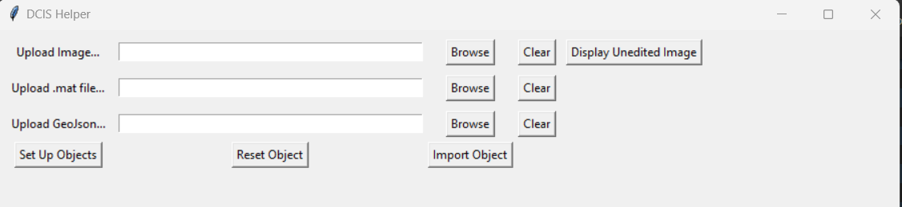
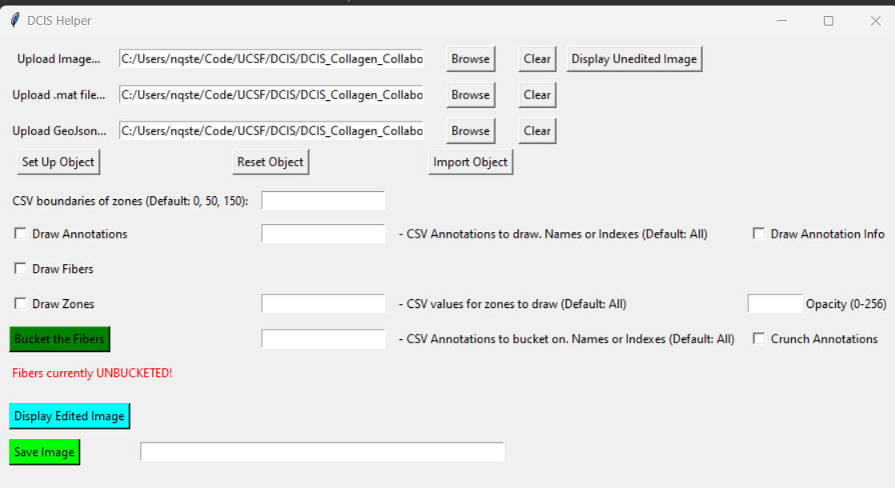
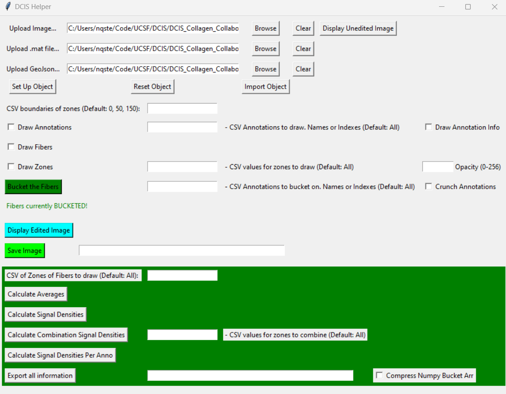

# __DCIS Project__ _V 0.9_
## Project Description: 
This repo was built to help analyze DCIS samples with CTFire Results. 

## Usage:
In order to run the GUI Application, simply run gui_main.exe which is found in the Executable/dist directory. 

## Breakdown of GUI
### First Opening the Application

When the GUI is first opened up you will see text boxes which show the 3 pieces needed to continue. You will require:
1. An Image File that represents the tissue. Generally a .tif file. You can also display the uneditted image. 
2. A .mat file that represents the output of a CTFire Application. 
    - Note: There are many different .mat files that generated from CTF. Please use the main .matfile, the one that is generally the name of the image file
3. A GeoJSON File that represents exported data from QuPath. This GeoJSON file should contain the annotations (DCIS, Ignore, etc) with their associated information and points.

Each of these files can be inputted directly, or can easily be chosen via a finder by clicking the browse button.

Once the files are inputted, you can selec the "Set Up Object" button. If you try to click this button before all of the files are selected you will be faced with an error. Once it is set up you will be given more options. Note: The object set up can take a few seconds, so if it looks like it is stalling, just wait a few seconds and you should see more options.

Additionally, you can also optionally import an object/configuration. This will be explained in more detail exporting section below. In summary, you should select a json file that was generated form the export button. If you want the bucketed fibers as well, then there should be a npy file in the same directory as the json file selected. The npy file will be generated if you click the "Compress Numpy Bucket Arr" checkbox when exporting.

### Once the Object is Set Up (Without Bucketing)


Once the Object is set up, you will given a new set of options:
1. CSV Boundaries of Zones: This textbox represents the size (in pixels) of the desired zones. The zones reprsent how far from the annotation linings are from the epithelial edge.  This textbox like all the others requires you to put in the number values in csv form like 0,number1, number2, number3 etc. (By default it is 0, 50, 150). 
    - Note: It is currently required, to put in 0 for the first zone.
2.  Drawing Annotations: This row is dedicated to just drawing the annotations gotten from the GeoJSON. There are 3 pieces: 
    - Draw Annotation Checkbox: If this checkbox is selected, then the annotations will be drawn on the image.
    - CSV Values: You can choose with fine detail exactly which Annotations you would like to draw. If nothing is inputted then it will draw all annotations by default. Otherwise, you can add numbers (representing the indexes of the annotations) or the names of the annotation type as specified in QuPath. Some valid examples are: [1,2], [DCIS], [DCIS, Ignore], or [Annotation_Type, index_number].
    - Draw Annotation Info Checkbox: If this checkbox is selected, then if the annotations are drawn, the names and index of the index will be drawn along with each annotation.
3. Draw Fibers: This will draw the fibers onto the image.
4. Bucketing the Fibers: Clicking this button will bucket the fibers and allow the user to perform more actions. Bucketing the fibers runs an algorithm that will create an array that "buckets" the fibers based on their zones. The Arrays shape will be (# of fibers, # of annotations), and the value will be the zone that the fiber falls into (as assigned by the user in the CSV boundaries of zones above). The bucketing algorithm can take some time, but since it is ran on its own thread, you can still interact with the window during its runtime. 
    - CSV Values: This CSV values works like the drawing annotations portion above. The zones are defined by two things, the sepcified zone pixel values and the annotations you want to put the zones around. The values can be numbers or annotation names.
5. Displaying Image Button: This button will display the image in a new window will all things drawn on.
6. Save the image: Save image into a new tif file. 

### Once the fibers are Bucketed


Once the fibers are bucketed, you will be given the new final set of options: 
1. CSV of Zones of Fibers to Draw: This textbox represents the zones of the fibers you want to draw. If this textbox has the number values of the zones, then if the draw fibers checkbox is selcted, instead of drawing all of the fibers, then only the fibers that fall into the specific zones you selected will be drawn.   
2. Draw Zones Checkbox: If this checkbox is selcted then, outlines of the zones will be displayed on the images. Associated textbox allows you to put the numbers of the zones you wish to draw on. 
3. Calculate Averages: This button will allow show you the average lengths, widths, and angles in the entire image and for each zone. It will display them to the window, and display them in the output.  
4. Calculate Signal Densities: This button will display all of the Signal Densities in Each Zone. 
5. Calculate Combination Signal Densities: This Button will allow you to display the signal density with a combination of zones, as specified by the associated textbox. For example, if you wanted to calculate the stromal region only, you would add every zone except zone zero in the associated textbox, and you will get that.
6. Calculate the Signal Densities per Annotation: This will display only the signal density for each annotation (not its assoicated zones). So you will get a value for each annotation
7. Exporting all information button: Exporting all the information will make it so you can save all of the settings, and numbers generated int files. 
    - Exporting all the information will create a few different files: 
        1. A JSON file. This file makes it easy to see all of the information in a human friendly way. Additionally, this is the file that you would import with the import button above. 
        2. A TSV File: This file has all of the same information as the json file, but in a tab separated value file. The reason for this file is so that you can easily copy these values into excel or other tabling software easily. 
        3. A TXT File: This file has all of the bucket fiber information in a txt file that makes it easy to copy all of the bucket information into excel files as well. 
    - Compress Numpy Bucket Array: Clicking this button will create an additional npy file that has the bucket fibers array. You will need to export this information if you wish to import the bucket fiber array. 


### In the Image Window:
One additional functionality that the user may find helpful is, if they are displaying a window. If they click any part of the window and the clicked point is in an annoation, it will display information about the annotation. Ex: POINT (1179.375 1863.875) - Annotation DCIS, 26, [255, 0, 255], (1457, 2)


## Running the code: 
```sh
python -m venv .\path\to\new\venv
.\venv\Scripts\activiate
pip install -r requirements.txt
python3 gui_boi.py
```
