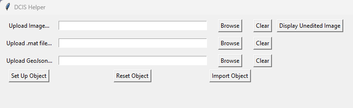
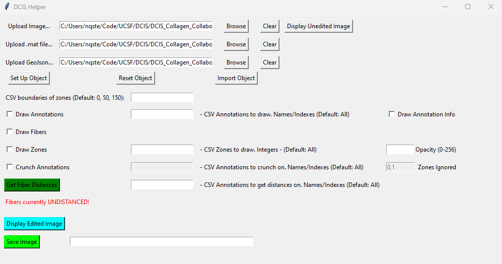
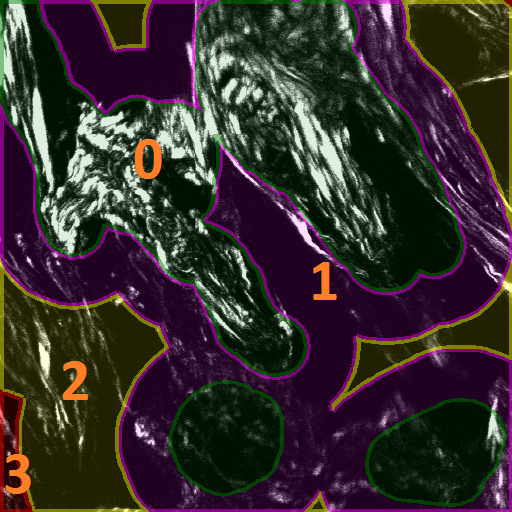
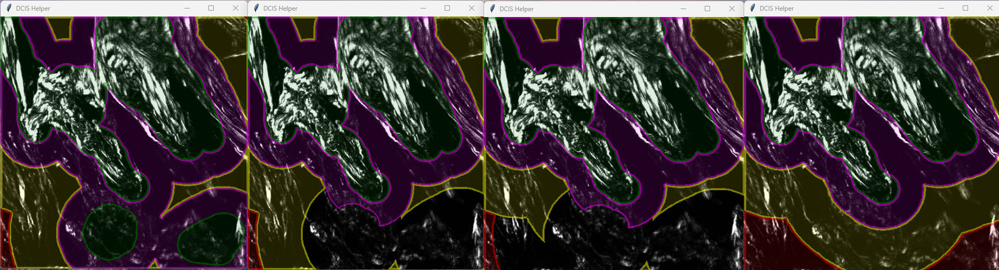
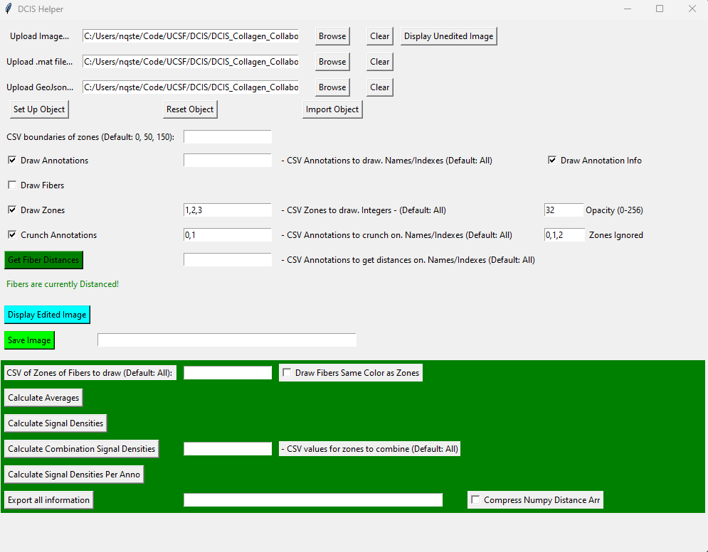

# __Stromal Zoning tool for CT-FIRE Annotations__ _V 0.9_
## Project Description: 
This repo was built to help analyze DCIS samples with CTFire Results. 

## Usage:
__In order to run the GUI Application, simply run gui_main.exe which is found in the Executable/dist directory.__

## Breakdown of GUI
### First Opening the Application


When the GUI is first opened up you will see text boxes which show the 3 pieces needed to continue. You will require:
1. __Upload Image__: An Image File that represents the tissue. Generally a .tif file. To confirm you selected the desired image, you can display the unedited image. 
2. __Upload .mat file__: A .mat file that represents the output of a CTFire Application. 
    - Note: There are many different .mat files that generated from CTF. Please use the main .matfile, the one that is generally the name of the image file.  Example: ctFIREout_2B_D9_crop2.mat. Not the currentP or ROIS. 
3. __Upload GeoJson__: A GeoJSON File that represents exported data from QuPath. This GeoJSON file should contain the annotations (DCIS, Ignore, etc) with their associated information (name/color) and points. The points are required, but for best results make sure the annotations have names and colors.

Each of these files can be inputted directly, or can easily be chosen via a finder by clicking the browse button.

Once the files are inputted, you can select the "Set Up Object" button. If you try to click this button before all of the files are selected you will be faced with an error. Once it is set up you will be given more options which we will discuss below.
- Note: The object set up can take a few seconds, so if it looks like it is stalling, just wait a few seconds and you should see more options.

Additionally, you can also optionally import an object/configuration. This will be explained in more detail exporting section below. In summary, you should select a json file that was generated form the export button. If you want the distanced fibers as well, then there should be a npy file in the same directory as the json file selected. The npy file will be generated if you click the "Compress Numpy Bucket Arr" checkbox when exporting.

### Once the Object is Set Up (Without Distancing)


Once the Object is set up, you will given a new set of options:
1. __CSV Boundaries of Zones__: This textbox represents the size (in pixels) of the desired zones. The zones reprsent how far from the annotation linings are from the epithelial edge. Zones are always represented by integers. This textbox, like all the others where you can input mulitple values, requires you to put in the number values in csv form like 0, number1, number2, number3 etc. The zones should be zero and positive and in ascending order like the default. (By default it is 0, 50, 150), so you dont need to type anything in. 
    - Note: It is currently REQUIRED, to put in 0 for the first zone. For example if I want to add another zone at 200, I would put: 0, 50, 150, 200
2.  __Drawing Annotations__: This row is dedicated to just drawing the annotations gotten from the GeoJSON. There are 3 pieces: 
    - Draw Annotation Checkbox: If this checkbox is selected, then the annotations will be drawn on the image.
    - CSV Values: You can choose with fine detail exactly which Annotations you would like to draw. Annotations can either be integers or strings/text representing the classification (DCIS, Ignore) of the annotations. If nothing is inputted then it will draw all annotations by default. Otherwise, you can add numbers (representing the indexes of the annotations) or the names of the annotation type as specified in QuPath. Some valid examples are: [1,2], [DCIS], [DCIS, Ignore], or [Annotation_Type, index_number].
    - Draw Annotation Info Checkbox: If this checkbox is selected, then if the annotations are drawn, the names and index of the index will be drawn along with each annotation. This will be helpful for identifying specific annotations you want to get information about.
3. __Draw Fibers__: This will draw the fibers onto the image.
4. __Draw Zones Checkbox__: If this checkbox is selcted then, the zones will be displayed on the images.
    -  The associated textbox allows you specify the zone regions you want to draw by putting the associated zone number. The quantity of zones is 1 more than the amount of zones put in the csv value above. So 0 represents the annotation, 1 represents edge, etc. These should only be 0 and positive integer values. 
    - The opacity affects the transparency of the inner parts of the zones (Not the lining). The values range from 0 (meaning completely transparent) to 256 (Solid Color). If value is not in that range it will either default to the closer one of those values. 
    NOTE: Make sure to read about distancing and crunching in relation to drawing zones. Here is what a basic example with zones looks like: 
    
    
5. __Crunch Annotations Checkbox__: This checkbox allows you to "crunch" your annotation zones. Crunching the zones / annotations makes it so that the zones will be drawn in relation to the other annotations. This checkbox's functionality is best explained with the photo below: 
    

    Let's break down this photo and the images inside of it.
    - Image 1 (Farthest Left): This is the zones as they normally are not cruched. Notice how when two zones collide with eachother, they union with eachother as long as they are in the same zone. This photo means that we are not crunching (or we are crunching on all of the annotations). The annotation indexes go Top Left (0), Top Right (1), Bot Left (2), and Bot Right (3).
    - Image 2: This is an example shows crunching. When something is "crunched", we are saying focus on specific annotations and if it iteracts with the zone of an another important annotation then merge, otherwise ignore it. In this photo, we care only about the two top annotations. So, we want to ignore any other annotations and its zones where it has complete control over the area. You can choose which zones of other annotations you wish to ignore with the Zones Ignored Textbox. (See Crunching Rules). 

        Note: The configuration for this one is:  Crunch on 0,1 and Ignore 0, 1
    - Image 3: We are crunching, but this time, we are ignoring zone 2 as well as 0 and 1.

        Note: The configuration for this one is:  Crunch on 0,1 and Ignore 0, 1, 2
    - Image 4 (Farthest Right): This example we are not crunching, we instead are only caring about the top 2 annotations. (See Next Section)  
    
    - The way to see a crunched annotation is to:
        1. Have the draw zones checkbox selected
        2. Put the type (DCIS, Ignore etc) or specific integer annotation values that you want to crunch on
        3. (Optional) Change the Ignored Zones to desired ignored zones
        4. (Optional) Choose new base zones with get distances on textbox.
        5. Click the Crunching Values Checkbox. 
    NOTE: The best way to make sure that you have the correct configuration is to display the image, and do a quick confirmation that it looks as it should. 

    __Why do we have crunching?__ The reason for this is so that a fiber does not fall into a zone that it truly doesnt belong. If we created zones soley based on one type of annotation then we would get something like the farthest right image. This is an issue, because zone 2 (the yellow zone) is overwriting the annotations that fall in that zone. If the two examples above were DCIS lesions we cared about, and the two bottom annotations were atypia. We would definitely not count a fiber in the atypia as associated with the mid stromal zone (the yellow zone 2). As a result, we ignore the zones that are 'controlled' by Atypia.

    ### __Rules for Crunching__
    1. If two zones of the same value (eg Epith on Epith) collide, then count it as accepted zone for both annotations.
    2. If one zone of a higher value (like epitheial) merges into a zone of a lower value like annotation, then that area will be treated as the lower value zone.

5. __Distancing the Fibers__: Clicking this button will "distance" the fibers and allow the user to perform more actions. The distancing simply finds the minimum distance from each fiber centroid for each annotation. For example, if we had 4 annotations and 4 fibers we would have 16 values. This distanced are used to put the fibers in the proper zones. The Arrays shape will be (# of fibers, # of annotations), and the value will be the distance the fiber is from that annotation. The distancing algorithm can take some time, but since it is ran on its own thread, you can still interact with the window during its runtime. 
    - CSV Values: This CSV values works like the drawing annotations portion above. The zones are defined by two things, the sepcified zone pixel values and the annotations you want to put the zones around. The values can be numbers or annotation names.

6. __Displaying Image Button__: This button will display the image in a new window will all things drawn on.
    Note: This button and its associated configuration inputs in this section, should be used very frequently to confirm that you are correctly specifying the zones and fibers that you want to get information on. 
7. __Save the image__: Save image into a new tif file (tif, png, jpg). 

### Once the fibers are Bucketed


Once the fibers are distanced, you will be given the new final set of options: 
1. __CSV of Zones of Fibers to Draw__: This textbox represents the zones of the fibers you want to draw. If this textbox has the number values of the zones, then if the draw fibers checkbox is selected, instead of drawing all of the fibers, then only the fibers that fall into the specific zones you selected will be drawn. 
    - You can also choose to select Draw Fibers a Same Color as Zone Checkbox to do exactly that to quickly identify where fibers fall.
2. __Calculate Averages__: This button will allow show you the average lengths, widths, and angles in the entire image and for each zone. It will display them to the window, and display them in the output.  
3. __Calculate Signal Densities__: This button will display all of the Signal Densities in Each Zone. 
4. __Calculate Combination Signal Densities__: This Button will allow you to display the signal density with a combination of zones, as specified by the associated textbox. For example, if you wanted to calculate the stromal region only, you would add every zone except zone zero in the associated textbox, and you will get that.
5. __Calculate the Signal Densities per Annotation__: This will display only the signal density for each annotation (not its assoicated zones). So you will get a value for each annotation
6. __Exporting all information button__: Exporting all the information will make it so you can save all of the settings, and numbers generated int files. 
    - Exporting all the information will create a few different files: 
        1. A JSON file. This file makes it easy to see all of the information in a human friendly way. Additionally, this is the file that you would import with the import button above. 
        2. A TSV File: This file has all of the same information as the json file, but in a tab separated value file. The reason for this file is so that you can easily copy these values into excel or other tabling software easily. 
        3. A TXT File: This file has all of the bucket fiber information in a txt file that makes it easy to copy all of the distancing information into excel files as well. 
    - Compress Numpy Distancing Array: Clicking this button will create an additional npy file that has the Distancing fibers array. You will need to export this information if you wish to import the bucket fiber array. 

### In the Image Window:
One additional functionality that the user may find helpful is, if they are displaying a window. If they click any part of the window and the clicked point is in an annoation, it will display information about the annotation. Ex: POINT (1179.375 1863.875) - Annotation DCIS, 26, [255, 0, 255], (1457, 2)

Also you can have multiple windows open at the same time to help you compare and contrast.

## Running the code (if you so desire): 
```sh
python -m venv .\path\to\new\venv
.\venv\Scripts\activiate
pip install -r requirements.txt
python3 gui_boi.py
```

## Creating the Executable: 
```sh
pip install pyinstaller
pyinstaller gui_main.py --onefile
```

# Changelog: 
_V 0.9_ 5/8/23: Added Crunching Functionality, Changed bucketing to distancing, Reordered configuration set up, added display funcitonality (fibers specific colors), and Fixed README


# Upcoming Changes and Features:
1. Significantly improve logging
2. Use same functionality to address DCIS stiffness
3. Color Picker for Zones